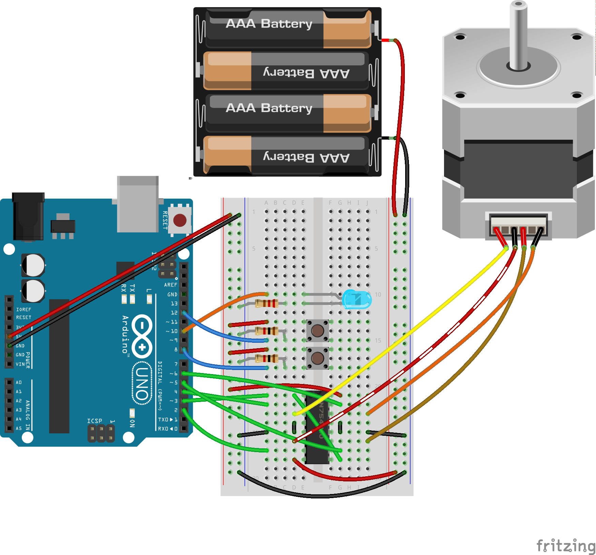
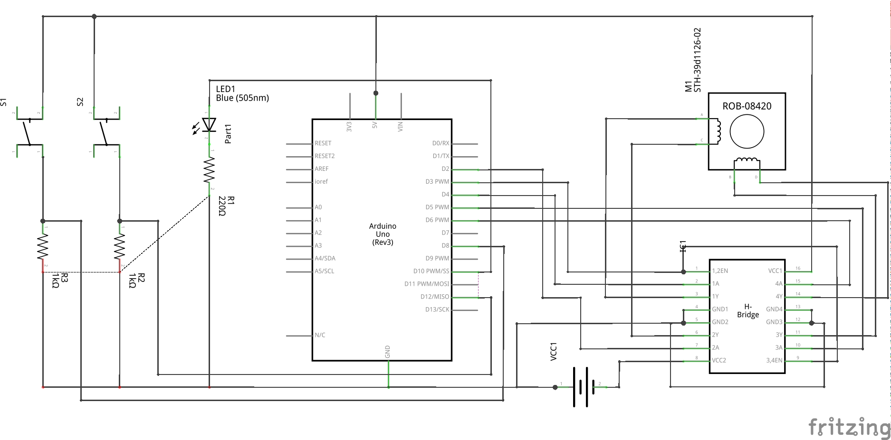

===============
scanner stepper
===============

Play music with a scanner stepper motor.

TODO: add a link to a video

Requirements
============

Hardware
--------

Materials used:

* 1 × Arduino starter kit

  * 1 × Arduino Uno Rev3
  * 1 × L293D H Bridge
  * 1 × 220 ohm resistor
  * 2 × 1k ohm resistors
  * 1 × LED
  * 2 × switch buttons
  * 1 × USB cable
  * 4 × male header pins

* 1 × ScanJet 5100C (HP C5 190A)

  * 1 × Stepper motor (STH-39D1126-02, 1.8 deg/step, 4.1 ohms)

* 1 × 9.6 volt battery (8 × AA 1.2 V NiMH cells, LEGO parts)
* 2 × header cables

Software
--------

* Arduino IDE
* Python 2.7

  * aubio
  * numpy
  * scipy

Usage
=====

* audio2txt.py: Reads a WAV file and uses pitch detection to produce a text file.
* txt2serial.py: Writes to the serial line on the Arduino. The Arduino IDE serial monitor must be open or it locks up.
* txt2wav.py: Converts a text file to a WAV file. Used for quickly listening the text file.
* scanner_stepper.ino: The Arduino program. Adjust the voltage as necessary so it doesn't burn out the H-bridge.

Contact
=======

* Email: chris.foo@gmail.com.
* Twitter: @chfoo0

